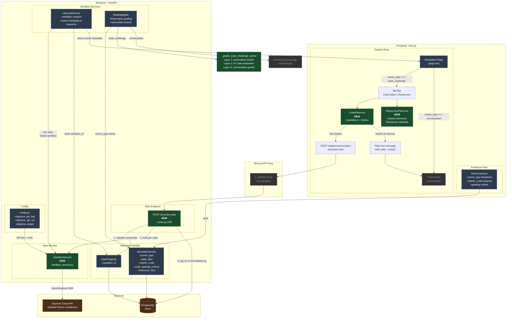
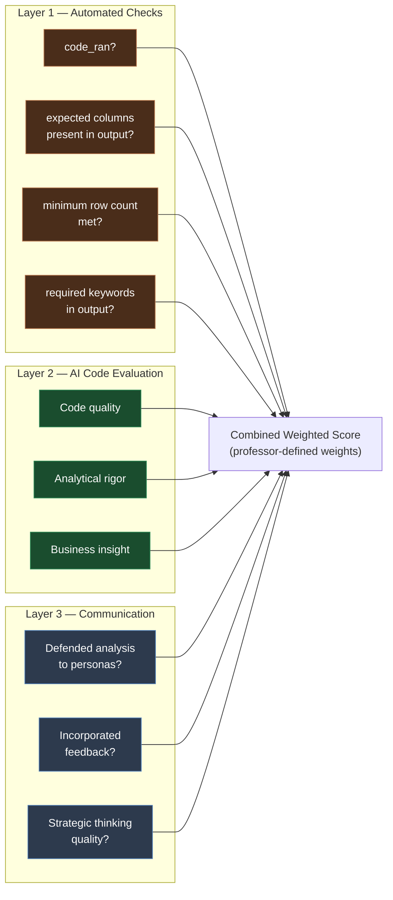
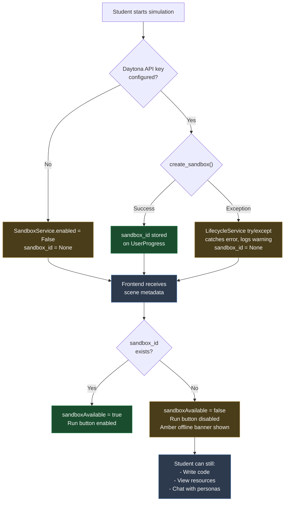

# Daytona Code Sandbox - Architecture Assessment

## Scope: 24 files changed, +5,109 / -69 lines across 4 commits

---

## Backend Changes (12 files)

### 1. Configuration (`config.py`)
- 3 new env vars: `daytona_api_key`, `daytona_api_url`, `daytona_target`
- Optional with sensible defaults - zero impact on existing deployments

### 2. Database Schema (3 files)
- `SimulationScene` model: 5 new fields (`scene_type`, `data_files`, `starter_code`, `code_grading_criteria`, `reference_files`) - all nullable/defaulted, backward-compatible
- `UserProgress` model: 1 new field (`sandbox_id`) - nullable
- Alembic migration chains correctly from `add_conv_logs_indexes`, clean downgrade

### 3. SandboxService (`sandbox_service.py`) - 197 lines, NEW
- Singleton pattern matching existing services (cache_service, s3_service)
- 4 methods: `create_sandbox`, `execute_code`, `upload_file`, `delete_sandbox`
- Uses `AsyncDaytona` SDK natively (no `run_in_executor` needed)
- Graceful degradation: `self.enabled = False` when no API key, all methods return safe defaults
- Output truncation at 5,000 chars to prevent UI/DB bloat
- Auto-stop (60min), auto-archive (2h), auto-delete (24h) on sandboxes

### 4. LifecycleService (`lifecycle_service.py`) - ~30 lines added
- Sandbox creation in `start_simulation()` after UserProgress commit - only when `code_challenge` scenes exist
- `try/except` ensures simulation starts even if Daytona fails (sandbox_id stays None)
- Scene metadata (`scene_type`, `starter_code`, `data_files`, `reference_files`) added to all 4 scene response dict locations (start current, start all_scenes, resume current, resume all_scenes)

### 5. Execute-code endpoint (`router.py`) - 58 lines added
- `POST /execute-code` with ownership validation (`user_progress.user_id == current_user.id`)
- Checks `sandbox_id` exists before executing
- Logs every execution as `ConversationLog` with `message_type="code_submission"` - this means grading sees the code
- Properly resolves `session_id` from existing conversation entries

### 6. Grading Agent (`grading_agent.py`) - 201 lines added
- `grade_scene()` now dispatches: `scene_type == "code_challenge"` → `_grade_code_challenge_scene()`
- `_run_automated_checks()` - Layer 1 deterministic checks (code_ran, columns_found, missing_columns, rows_sufficient, output_keywords)
- `_grade_code_challenge_scene()` - Combines Layer 1 results + Layer 2+3 AI evaluation with professor's rubric and grading weights
- Existing conversation scenes are completely untouched (dispatch defaults to original `grade_scene` logic)

### 7. DTOs (`dto.py`) - 14 lines added
- `CodeExecutionRequest`: user_progress_id, code, scene_id
- `CodeExecutionResponse`: success, output, error

---

## Frontend Changes (6 files)

### 1. CodeEditor.tsx - 142 lines, NEW
- CodeMirror with Python syntax + oneDark theme (dynamic import, SSR disabled)
- "Run" button → `POST /api/proxy/simulation/execute-code`
- "Submit & Discuss" → formats code+output as Markdown and calls `onSubmitToChat` (plain chat message)
- Offline mode: disabled Run button + amber banner when `sandboxAvailable=false`

### 2. ResourcesPanel.tsx - 209 lines, NEW
- Scene objective display with data path hint
- Expandable dataset cards with table preview (headers + 5 rows)
- Reference materials as download links
- `pd.read_csv()` hint per file

### 3. Simulation page (`page.tsx`) - 65 lines modified
- Dynamic import for CodeEditor (SSR false)
- Extended `Scene` interface with `scene_type`, `starter_code`, `data_files`, `reference_files`
- Tab bar: "Code Editor" and "Resources" tabs appear conditionally for `code_challenge` scenes
- Tab content panels for both new tabs

### 4. SceneCard.tsx - 100 lines modified (professor UI)
- Scene type dropdown (Conversation / Code Challenge)
- Conditional code challenge settings: starter code textarea, rubric prompt, expected columns, min rows
- Fields properly saved back to the API

### 5. Package changes
- Added `@uiw/react-codemirror`, `@codemirror/lang-python`, `@codemirror/theme-one-dark`
- New `pnpm-lock.yaml` (3,656 lines)

---

## Risk Assessment

| Area | Risk | Mitigation |
|------|------|------------|
| Existing simulations | None | `scene_type` defaults to `"conversation"`, all new fields nullable, dispatch in grading agent defaults to existing path |
| Daytona unavailable | Low | Graceful degradation at 3 levels: SandboxService disabled, LifecycleService try/except, frontend offline mode |
| Database migration | Low | All columns nullable or have server_default, clean downgrade path |
| Frontend build | None | Build passes, CodeMirror dynamically imported (SSR safe) |
| Chat flow | None | Zero changes to ChatHandler - "Submit & Discuss" is a plain text message |

---

## Architecture Diagram

### Legend
- **Green nodes**: New files/components
- **Blue nodes**: Modified existing files
- **Gray nodes**: Unchanged (pass-through)
- **Brown nodes**: External services

---

## Data Flow Summary

### Professor creates a code challenge
`SceneCard` → saves `scene_type="code_challenge"` + `starter_code` + `code_grading_criteria` → `SimulationScene` table

### Student starts simulation
`LifecycleService.start_simulation()` → detects code_challenge scenes → `SandboxService.create_sandbox()` → stores `sandbox_id` on `UserProgress` → returns scene metadata with `scene_type` to frontend

### Student writes & runs code
`CodeEditor` → `POST /execute-code` → proxy → router validates ownership → `SandboxService.execute_code()` → Daytona Cloud → output returned → logged as `ConversationLog(message_type="code_submission")`

### Student submits for discussion
"Submit & Discuss" → formats code+output as plain markdown text → sends as regular chat message → personas see it as conversation context → **zero ChatHandler modifications**

### Grading
`GradingAgent.grade_scene()` → checks `scene_type` → dispatches to `_grade_code_challenge_scene()` → Layer 1 automated checks → Layer 2+3 AI evaluation with rubric → combined weighted score

---

## Three-Layer Grading Detail

---

## Graceful Degradation Chain

