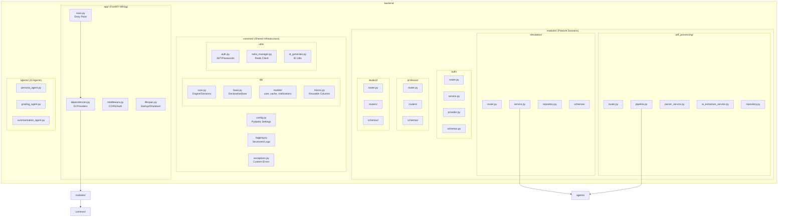
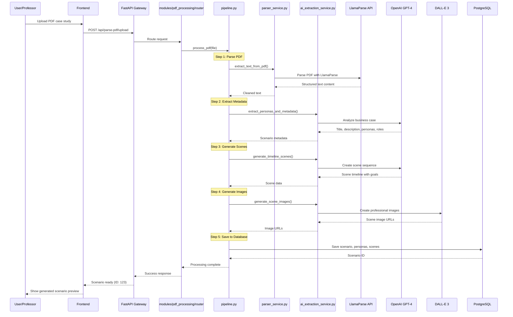
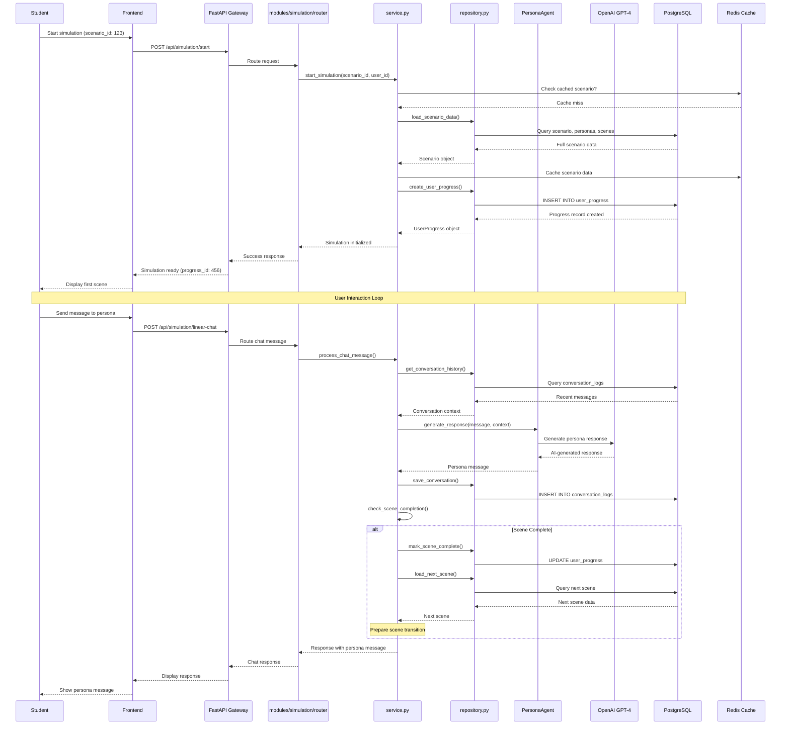
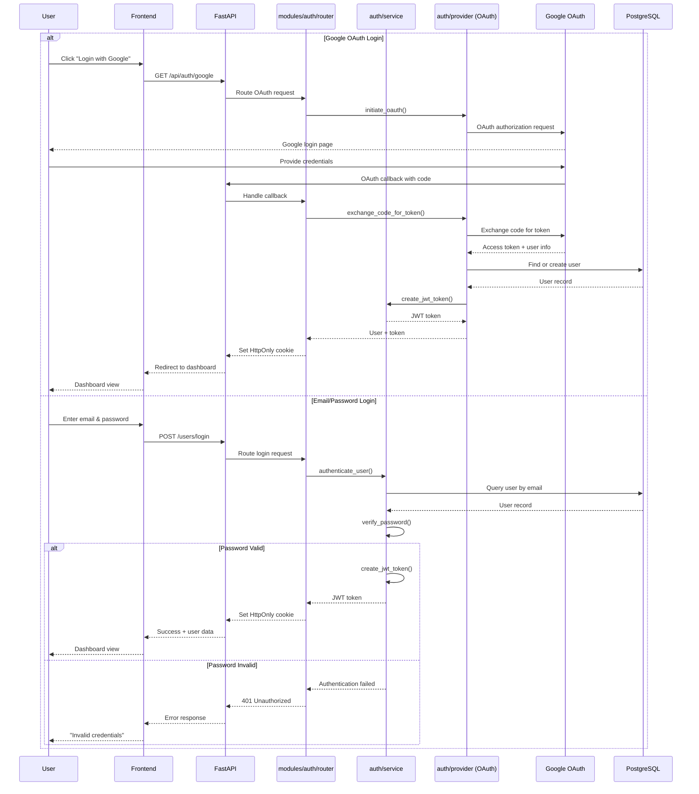
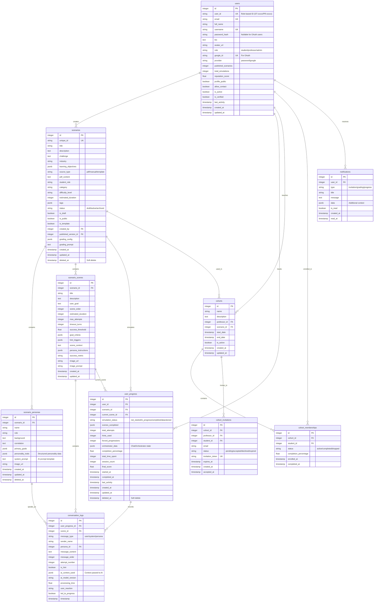
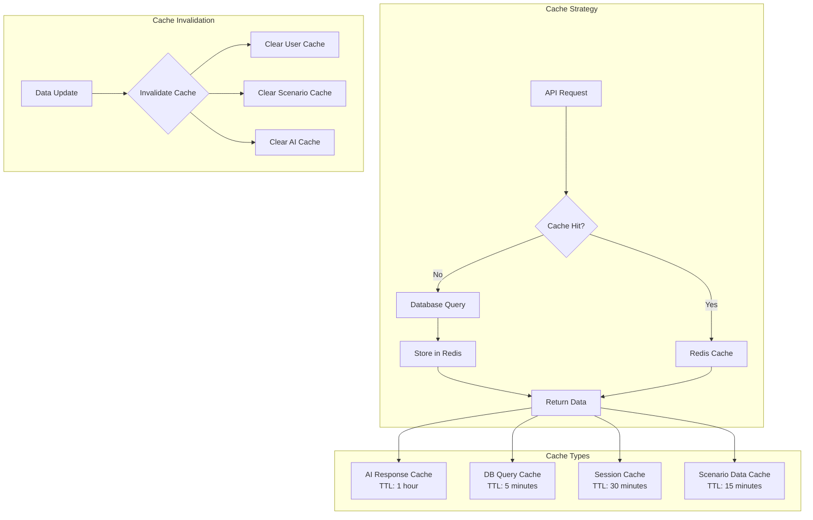
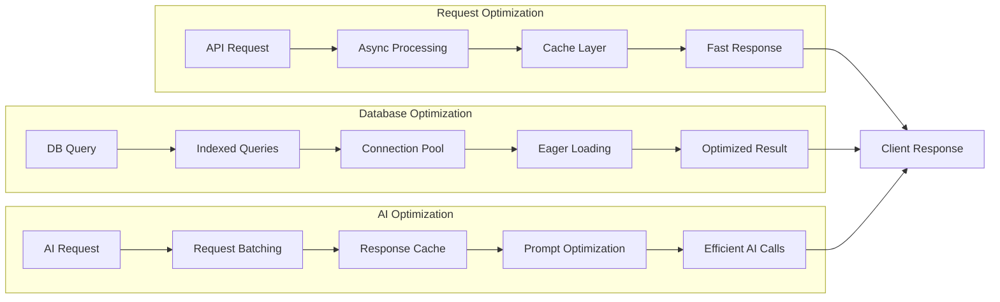
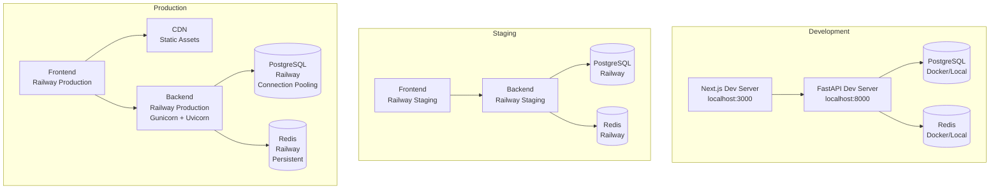

# AI Agent Education Platform - Architecture Diagram

## System Overview

This document provides a comprehensive visual representation of the AI Agent Education Platform architecture, showing the complete system from user interface to data storage, including the PDF-to-simulation pipeline and modular backend structure.

## High-Level System Architecture

```mermaid
graph TB
    subgraph "User Interface Layer"
        WEB[Web Browser<br/>Next.js 15 Frontend]
        MOBILE[Mobile Interface<br/>Responsive Design]
    end
    
    subgraph "Frontend Application (Next.js 15)"
        DASHBOARD[Dashboard<br/>/dashboard]
        CHATBOX[Chat Interface<br/>/student/simulation-instances]
        SIMULATION_BUILDER[Simulation Builder<br/>/professor/simulation-builder]
        COHORTS[Cohorts<br/>/professor/cohorts]
        PROFILE[Profile<br/>/profile]
    end
    
    subgraph "API Gateway & Middleware"
        FASTAPI[FastAPI Server<br/>app/main.py]
        AUTH[Authentication<br/>JWT + OAuth Middleware]
        CORS[CORS Middleware<br/>Cross-Origin Support]
        CACHE[Cache Layer<br/>Redis]
    end
    
    subgraph "Backend Modules (Feature-Based)"
        direction TB
        subgraph "modules/simulation"
            SIM_ROUTER[router.py<br/>Endpoints]
            SIM_SERVICE[service.py<br/>Business Logic]
            SIM_REPO[repository.py<br/>Data Access]
        end
        subgraph "modules/pdf_processing"
            PDF_ROUTER[router.py<br/>Endpoints]
            PDF_PIPELINE[pipeline.py<br/>Orchestration]
            PDF_SERVICES[parser_service.py<br/>ai_extraction_service.py]
        end
        subgraph "modules/auth"
            AUTH_ROUTER[router.py<br/>Endpoints]
            AUTH_SERVICE[service.py<br/>Auth Logic]
            AUTH_PROVIDER[provider.py<br/>OAuth]
        end
        subgraph "modules/professor"
            PROF_ROUTER[router.py<br/>Main Router]
            PROF_SUBROUTERS[routers/<br/>cohorts, grading, invitations]
        end
        subgraph "modules/student"
            STU_ROUTER[router.py<br/>Main Router]
            STU_SUBROUTERS[routers/<br/>simulation_instances, cohorts]
        end
    end
    
    subgraph "Common Infrastructure (common/)"
        direction TB
        CONFIG[config.py<br/>Settings]
        DB_CORE[db/core.py<br/>Engine & Sessions]
        DB_MODELS[db/models/<br/>user, cache, notifications]
        UTILS[utils/<br/>auth, redis, id_generator]
    end
    
    subgraph "AI Agents"
        PERSONA_AGENT[Persona Agent<br/>persona_agent.py]
        SUMMARIZATION_AGENT[Summarization Agent<br/>summarization_agent.py]
        GRADING_AGENT[Grading Agent<br/>grading_agent.py]
    end
    
    subgraph "External AI Services"
        OPENAI[OpenAI GPT-4<br/>Language Model]
        LLAMAPARSE[LlamaParse API<br/>PDF Processing]
        DALL_E[DALL-E 3<br/>Image Generation]
    end
    
    subgraph "Data Storage Layer"
        POSTGRES[(PostgreSQL Database<br/>Primary Data Store)]
        REDIS_STORE[(Redis<br/>Cache & Sessions)]
        FILE_STORAGE[File Storage<br/>PDFs & Images]
    end
    
    WEB --> DASHBOARD
    WEB --> CHATBOX
    WEB --> SIMULATION_BUILDER
    MOBILE --> DASHBOARD
    
    DASHBOARD --> FASTAPI
    CHATBOX --> FASTAPI
    SIMULATION_BUILDER --> FASTAPI
    COHORTS --> FASTAPI
    PROFILE --> FASTAPI
    
    FASTAPI --> AUTH
    FASTAPI --> CORS
    FASTAPI --> CACHE
    
    FASTAPI --> SIM_ROUTER
    FASTAPI --> PDF_ROUTER
    FASTAPI --> AUTH_ROUTER
    FASTAPI --> PROF_ROUTER
    FASTAPI --> STU_ROUTER
    
    SIM_ROUTER --> SIM_SERVICE
    SIM_SERVICE --> SIM_REPO
    SIM_SERVICE --> PERSONA_AGENT
    
    PDF_ROUTER --> PDF_PIPELINE
    PDF_PIPELINE --> PDF_SERVICES
    PDF_SERVICES --> LLAMAPARSE
    PDF_SERVICES --> OPENAI
    PDF_SERVICES --> DALL_E
    
    AUTH_ROUTER --> AUTH_SERVICE
    AUTH_SERVICE --> AUTH_PROVIDER
    
    PROF_ROUTER --> PROF_SUBROUTERS
    STU_ROUTER --> STU_SUBROUTERS
    
    SIM_REPO --> DB_CORE
    PDF_SERVICES --> DB_CORE
    AUTH_SERVICE --> DB_CORE
    
    DB_CORE --> DB_MODELS
    DB_CORE --> POSTGRES
    
    CACHE --> REDIS_STORE
    UTILS --> REDIS_STORE
    
    PERSONA_AGENT --> OPENAI
    SUMMARIZATION_AGENT --> OPENAI
    GRADING_AGENT --> OPENAI
    
    PDF_SERVICES --> FILE_STORAGE
```



## Backend Modular Architecture

The backend follows a **lightweight, feature-first layout** emphasizing pragmatic organization:



**Key Principles:**
- **One-way dependencies**: `app` → `modules` → `common` (prevents circular imports)
- **Feature ownership**: Each module owns router, service, repository, schemas
- **Shared models**: Common tables (User, Cache, Notifications) in `common/db/models/`
- **Domain models**: Feature-specific models in module directories
- **Repository pattern**: Data access abstraction for testability

## PDF-to-Simulation Pipeline Flow



## Simulation Execution Flow



## Authentication & Authorization Flow



## Database Schema Architecture



## Caching Architecture



## Performance Optimization Strategy



## Security Architecture

```mermaid
graph TB
    subgraph "Authentication Layer"
        JWT[JWT Tokens<br/>30min expiry]
        OAUTH[Google OAuth<br/>Secure flow]
        COOKIE[HttpOnly Cookies<br/>Secure + SameSite]
    end

    subgraph "Authorization Layer"
        RBAC[Role-Based Access<br/>student/professor/admin]
        OWNERSHIP[Resource Ownership<br/>creator checks]
        PERMISSION[Permission Checks<br/>require_admin()]
    end
    
    subgraph "Data Protection"
        HASH[Password Hashing<br/>bcrypt]
        VALIDATION[Input Validation<br/>Pydantic schemas]
        SANITIZATION[SQL Injection Prevention<br/>SQLAlchemy ORM]
        ENCRYPTION[Data Encryption<br/>PostgreSQL SSL]
    end

    subgraph "API Security"
        RATE_LIMIT[Rate Limiting<br/>Per user/endpoint]
        CORS_POLICY[CORS Policy<br/>Restricted origins]
        HTTPS[HTTPS Only<br/>Production]
    end

    JWT --> RBAC
    OAUTH --> RBAC
    COOKIE --> JWT
    RBAC --> OWNERSHIP
    OWNERSHIP --> PERMISSION
    HASH --> VALIDATION
    VALIDATION --> SANITIZATION
    RATE_LIMIT --> CORS_POLICY
    CORS_POLICY --> HTTPS
```

## Deployment Architecture



## Technology Stack

### Backend Technologies
- **FastAPI** - High-performance async web framework with automatic OpenAPI docs
- **Python 3.11+** - Modern Python with type hints and async support
- **SQLAlchemy** - Advanced ORM with PostgreSQL integration and JSONB support
- **Pydantic** - Data validation, serialization, and settings management
- **Alembic** - Database migration management with version control
- **Redis** - High-performance caching and session storage
- **uv** - Fast Python package installer and dependency manager

### AI/ML Technologies
- **OpenAI GPT-4** - Advanced language model for persona interactions and content generation
- **LlamaParse** - Intelligent PDF processing and structured data extraction
- **DALL-E 3** - AI image generation for scene visualization
- **LangChain** - AI framework for agent orchestration and memory management

### Frontend Technologies
- **Next.js 15** - React framework with TypeScript and App Router
- **Tailwind CSS** - Utility-first CSS framework
- **shadcn/ui** - Modern component library built on Radix UI
- **React Hook Form** - Performant form management with validation
- **Zod** - TypeScript-first schema validation

### Database & Storage
- **PostgreSQL** - Primary database with JSONB and vector extensions
- **Redis** - Caching and session management
- **Wasabi/AWS S3** - Object storage for files and images

### DevOps & Infrastructure
- **Railway** - Cloud deployment platform
- **Docker** - Containerization for local development
- **GitHub Actions** - CI/CD pipeline
- **Pytest** - Comprehensive testing framework

## Key Architecture Principles

### 1. Modular Design
- Feature-based organization for better code navigation
- Self-contained modules with clear boundaries
- Minimal cross-module dependencies

### 2. Separation of Concerns
- Routers handle HTTP concerns (validation, status codes)
- Services contain business logic (orchestration, transformations)
- Repositories abstract data access (queries, transactions)

### 3. Performance First
- Redis caching for frequently accessed data
- Async processing for I/O-bound operations
- Database query optimization with indexes and eager loading
- Connection pooling for database efficiency

### 4. Security by Design
- JWT-based authentication with HttpOnly cookies
- Role-based access control for authorization
- Input validation with Pydantic schemas
- SQL injection prevention via SQLAlchemy ORM

### 5. Scalability
- Stateless API design for horizontal scaling
- Feature modules can scale independently
- Caching strategy reduces database load
- Background task processing for long-running operations

This architecture provides a robust, scalable, and maintainable foundation for the AI Agent Education Platform, supporting both current educational requirements and future growth in the AI-powered learning space.
