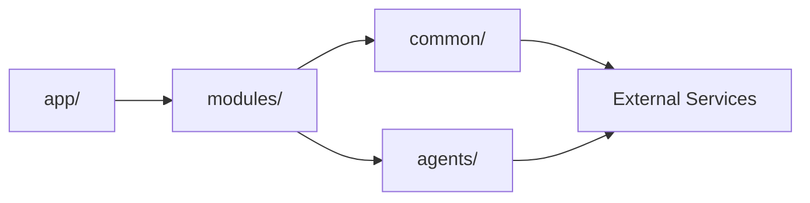

# Modular Architecture Migration Guide

## Overview

This document tracks the migration from the monolithic backend structure to a modular, feature-based architecture as defined in `architecture.md`.

## Migration Goals

1. **Improve code organization** - Group code by business capability
2. **Reduce coupling** - Clear module boundaries with one-way dependencies
3. **Enhance testability** - Isolated modules are easier to test
4. **Enable scalability** - Independent modules can scale separately
5. **Improve maintainability** - Easier to understand and modify

## Architecture Principles

### Dependency Direction



**Rule**: Dependencies flow in one direction only
- `app/` can import from `modules/`
- `modules/` can import from `common/` and `agents/`
- `common/` cannot import from `modules/` or `app/`
- No circular imports allowed

### Module Structure

Each module follows this pattern:

```
modules/<feature>/
├── __init__.py
├── router.py          # FastAPI endpoints
├── service.py         # Business logic
├── repository.py      # Data access
├── schemas/           # Pydantic models
│   ├── __init__.py
│   ├── dto.py         # Data transfer objects
│   └── models.py      # Domain models (optional)
├── tasks.py           # Background tasks (optional)
└── README.md          # Module documentation (optional)
```

## Migration Status

### ✅ Completed Migrations

#### 1. Common Infrastructure

**Status**: Complete

**Files**:
- ✅ `common/config.py` - Centralized Pydantic settings
- ✅ `common/db/base.py` - SQLAlchemy declarative base
- ✅ `common/db/core.py` - Engine, sessions, get_db()
- ✅ `common/db/mixins.py` - Reusable model columns
- ✅ `common/db/models/user.py` - User ORM model
- ✅ `common/db/models/cache.py` - Cache model
- ✅ `common/db/models/notifications.py` - Notification model
- ✅ `common/exceptions.py` - Custom exception classes
- ✅ `common/logging.py` - Structured logging setup

**Notes**:
- Settings now use Pydantic with environment variable loading
- Database engine configured with proper connection pooling
- Shared models extracted to `common/db/models/`

#### 2. PDF Processing Module

**Status**: Complete

**Files**:
- ✅ `modules/pdf_processing/__init__.py`
- ✅ `modules/pdf_processing/router.py` - Upload and progress endpoints
- ✅ `modules/pdf_processing/pipeline.py` - Orchestration logic
- ✅ `modules/pdf_processing/parser_service.py` - LlamaParse integration
- ✅ `modules/pdf_processing/ai_extraction_service.py` - GPT-4 extraction
- ✅ `modules/pdf_processing/progress_service.py` - WebSocket progress
- ✅ `modules/pdf_processing/repository.py` - Data persistence
- ✅ `modules/pdf_processing/schemas.py` - Pydantic models

**Migration Path**:
```
api/parse_pdf.py
├── Endpoints → modules/pdf_processing/router.py
├── Pipeline logic → modules/pdf_processing/pipeline.py
├── Parser calls → modules/pdf_processing/parser_service.py
├── AI extraction → modules/pdf_processing/ai_extraction_service.py
├── Progress tracking → modules/pdf_processing/progress_service.py
└── DB operations → modules/pdf_processing/repository.py
```

**Benefits**:
- Clear separation of concerns
- Easier to test individual components
- Progress tracking isolated from business logic
- Repository pattern enables mocking for tests

#### 3. Authentication Module

**Status**: Complete

**Files**:
- ✅ `modules/auth/__init__.py`
- ✅ `modules/auth/router.py` - Login, OAuth endpoints
- ✅ `modules/auth/service.py` - Authentication logic
- ✅ `modules/auth/provider.py` - Google OAuth integration
- ✅ `modules/auth/schemas.py` - Auth request/response models

**Migration Path**:
```
api/oauth.py + utilities/oauth.py
├── OAuth endpoints → modules/auth/router.py
├── OAuth logic → modules/auth/provider.py
├── Auth helpers → modules/auth/service.py
└── Auth models → modules/auth/schemas.py
```

**Key Features**:
- Google OAuth with state management
- Periodic cleanup of expired OAuth states
- HttpOnly cookie-based authentication
- JWT token generation and validation

#### 4. Professor Module

**Status**: Complete

**Files**:
- ✅ `modules/professor/__init__.py`
- ✅ `modules/professor/router.py` - Main router with sub-router includes
- ✅ `modules/professor/routers/cohorts.py` - Cohort management
- ✅ `modules/professor/routers/grading.py` - Grading interface
- ✅ `modules/professor/routers/grading_materials.py` - Grading materials
- ✅ `modules/professor/routers/invitations.py` - Student invitations
- ✅ `modules/professor/routers/messages.py` - Messaging
- ✅ `modules/professor/routers/notifications.py` - Notifications
- ✅ `modules/professor/schemas/models.py` - Professor-specific models

**Migration Path**:
```
api/professor/*.py
├── cohorts.py → modules/professor/routers/cohorts.py
├── grading.py → modules/professor/routers/grading.py
├── invitations.py → modules/professor/routers/invitations.py
├── messages.py → modules/professor/routers/messages.py
└── notifications.py → modules/professor/routers/notifications.py
```

**Pattern**: Sub-routers for large modules
- Main router includes sub-routers
- Each sub-router handles related endpoints
- Prevents router files from becoming too large

#### 5. Student Module

**Status**: Complete

**Files**:
- ✅ `modules/student/__init__.py`
- ✅ `modules/student/router.py` - Main router
- ✅ `modules/student/routers/simulation_instances.py` - Student simulations
- ✅ `modules/student/routers/cohorts.py` - Student cohort view
- ✅ `modules/student/routers/messages.py` - Student messaging
- ✅ `modules/student/routers/notifications.py` - Student notifications
- ✅ `modules/student/schemas/` - Student models

**Migration Path**:
```
api/student/*.py
├── simulation_instances.py → modules/student/routers/simulation_instances.py
├── cohorts.py → modules/student/routers/cohorts.py
├── messages.py → modules/student/routers/messages.py
└── notifications.py → modules/student/routers/notifications.py
```

### 🔄 In Progress

#### 1. Simulation Module

**Status**: Partial (router exists, needs service/repository extraction)

**Current State**:
- ✅ `modules/simulation/router.py` - Basic router exists
- ⏳ `modules/simulation/service.py` - Needs extraction from api/simulation.py
- ⏳ `modules/simulation/repository.py` - Needs DB query extraction
- ✅ `modules/simulation/schemas/models.py` - Basic schemas exist

**Next Steps**:
1. Extract business logic from `api/simulation.py` to `service.py`
2. Extract database queries to `repository.py`
3. Integrate with `agents/persona_agent.py`
4. Move ChatOrchestrator integration to service layer
5. Add comprehensive schemas for all endpoints

**Target Structure**:
```
modules/simulation/
├── __init__.py
├── router.py                    # ✅ Exists
├── service.py                   # ⏳ To be created
│   ├── start_simulation()
│   ├── process_chat_message()
│   ├── validate_goal()
│   └── get_progress()
├── repository.py                # ⏳ To be created
│   ├── get_scenario()
│   ├── create_progress()
│   ├── save_conversation()
│   └── update_progress()
├── schemas/
│   ├── models.py                # ✅ Exists
│   └── dto.py                   # ⏳ Add DTOs
└── agents/                      # Already exists in agents/
    ├── persona_agent.py
    ├── grading_agent.py
    └── summarization_agent.py
```

#### 2. Database Models Migration

**Status**: Partial

**Completed**:
- ✅ User model → `common/db/models/user.py`
- ✅ Cache model → `common/db/models/cache.py`
- ✅ Notification model → `common/db/models/notifications.py`

**Pending**:
- ⏳ Scenario model
- ⏳ ScenarioPersona model
- ⏳ ScenarioScene model
- ⏳ UserProgress model
- ⏳ ConversationLog model
- ⏳ Cohort model
- ⏳ CohortMembership model
- ⏳ CohortInvitation model

**Decision Required**: Where should these models live?

**Option 1: Shared models** (current approach for User, Cache, Notifications)
```
common/db/models/
├── user.py               # ✅ Complete
├── cache.py              # ✅ Complete
├── notifications.py      # ✅ Complete
├── scenario.py           # ⏳ Proposed
├── cohort.py             # ⏳ Proposed
└── ...
```

**Option 2: Module-specific models** (follows architecture.md more strictly)
```
modules/simulation/models/
├── scenario.py
├── scene.py
├── persona.py
└── progress.py

modules/professor/models/
├── cohort.py
├── invitation.py
└── membership.py
```

**Recommendation**: Use **Option 1** for models used by multiple modules, **Option 2** for module-specific models.

#### 3. Legacy Services Migration

**Current State**:
```
services/
├── simulation_engine.py         # ⏳ To modules/simulation/
├── session_manager.py           # ⏳ To common/services/
├── vector_store.py              # ⏳ To common/services/
├── ai_cache_service.py          # ⏳ To common/services/
├── db_cache_service.py          # ⏳ To common/services/
├── soft_deletion.py             # ⏳ To common/services/
├── notification_service.py      # ⏳ To modules/notifications/
└── ...
```

**Target State**:
```
common/services/
├── cache_service.py            # Unified caching (ai + db)
├── session_service.py          # Session management
├── vector_service.py           # Vector operations
└── soft_deletion_service.py    # Soft delete logic

modules/simulation/
└── service.py                  # Simulation logic from simulation_engine.py

modules/notifications/
└── service.py                  # Notification logic
```

### ⏳ Pending Migrations

#### 1. Publishing Module

**Status**: Not started

**Current Location**: `api/publishing.py`

**Target Structure**:
```
modules/publishing/
├── __init__.py
├── router.py          # Marketplace endpoints
├── service.py         # Publishing logic
├── repository.py      # Scenario queries
└── schemas/
    ├── dto.py         # Publish requests/responses
    └── models.py      # Publishing models
```

**Endpoints to Migrate**:
- `POST /api/scenarios/publish` - Publish scenario
- `GET /api/scenarios/marketplace` - Browse marketplace
- `POST /api/scenarios/{id}/rate` - Rate scenario
- `GET /api/scenarios/{id}/reviews` - Get reviews

#### 2. Notifications Module

**Status**: Partial (router exists, needs service extraction)

**Current Location**: Multiple places
- `api/professor/notifications.py`
- `api/student/notifications.py`
- `services/notification_service.py`

**Target Structure**:
```
modules/notifications/
├── __init__.py
├── router.py              # Unified notification endpoints
├── service.py             # Notification business logic
├── repository.py          # Notification queries
└── schemas/
    ├── dto.py             # Notification DTOs
    └── models.py          # Notification types
```

**Consolidation Strategy**:
1. Extract common notification logic to service
2. Unify professor and student notification endpoints
3. Add notification templates
4. Implement email integration

#### 3. Test Suite

**Status**: Minimal

**Current State**:
```
tests/
├── conftest.py           # Basic fixtures
└── modules/
    └── (mostly empty)
```

**Target Structure**:
```
tests/
├── conftest.py           # Shared fixtures
├── common/
│   └── fixtures.py       # Common test utilities
└── modules/
    ├── simulation/
    │   ├── test_router.py
    │   ├── test_service.py
    │   └── test_repository.py
    ├── pdf_processing/
    │   ├── test_pipeline.py
    │   ├── test_parser.py
    │   └── test_repository.py
    ├── auth/
    │   ├── test_router.py
    │   ├── test_service.py
    │   └── test_provider.py
    └── ...
```

**Testing Strategy**:
1. **Unit tests** - Test services and repositories with mocks
2. **Integration tests** - Test router + service + repository
3. **API tests** - Test HTTP endpoints end-to-end
4. **Fixtures** - Shared test data (users, scenarios, sessions)

## Migration Workflow

### Step-by-Step Process

#### 1. Identify Feature to Migrate

Choose a feature from `api/` or `services/` that represents a cohesive business capability.

Example: `api/simulation.py`

#### 2. Create Module Structure

```bash
mkdir -p modules/simulation/schemas
touch modules/simulation/__init__.py
touch modules/simulation/router.py
touch modules/simulation/service.py
touch modules/simulation/repository.py
touch modules/simulation/schemas/__init__.py
touch modules/simulation/schemas/dto.py
```

#### 3. Extract Router (HTTP Layer)

**Before** (`api/simulation.py`):
```python
@app.post("/api/simulation/start")
async def start_simulation(
    request: SimulationStartRequest,
    db: Session = Depends(get_db),
    current_user: User = Depends(get_current_user)
):
    # Business logic mixed with HTTP concerns
    scenario = db.query(Scenario).filter_by(id=request.scenario_id).first()
    if not scenario:
        raise HTTPException(404, "Scenario not found")
    
    progress = UserProgress(
        user_id=current_user.id,
        scenario_id=scenario.id,
        current_scene_id=scenario.scenes[0].id,
        simulation_status="in_progress"
    )
    db.add(progress)
    db.commit()
    
    return {"progress_id": progress.id}
```

**After** (`modules/simulation/router.py`):
```python
from modules.simulation.service import SimulationService
from modules.simulation.repository import SimulationRepository
from modules/simulation.schemas.dto import SimulationStartRequest, SimulationStartResponse

router = APIRouter(prefix="/api/simulation")

@router.post("/start", response_model=SimulationStartResponse)
async def start_simulation(
    request: SimulationStartRequest,
    db: Session = Depends(get_db),
    current_user: User = Depends(get_current_user)
):
    """Start a new simulation instance."""
    repository = SimulationRepository(db)
    service = SimulationService(repository)
    
    try:
        result = await service.start_simulation(request, current_user.id)
        return result
    except ValueError as e:
        raise HTTPException(400, str(e))
    except KeyError as e:
        raise HTTPException(404, f"Scenario {e} not found")
```

#### 4. Extract Service (Business Logic)

**Create** (`modules/simulation/service.py`):
```python
from modules.simulation.repository import SimulationRepository
from modules/simulation.schemas.dto import SimulationStartRequest, SimulationStartResponse

class SimulationService:
    def __init__(self, repository: SimulationRepository):
        self.repository = repository
    
    async def start_simulation(
        self,
        request: SimulationStartRequest,
        user_id: int
    ) -> SimulationStartResponse:
        """Start a new simulation for a user."""
        
        # Validate scenario exists
        scenario = self.repository.get_scenario(request.scenario_id)
        if not scenario:
            raise KeyError(request.scenario_id)
        
        # Validate scenario has scenes
        if not scenario.scenes:
            raise ValueError("Scenario has no scenes")
        
        # Create user progress
        progress = self.repository.create_progress(
            user_id=user_id,
            scenario_id=scenario.id,
            first_scene_id=scenario.scenes[0].id
        )
        
        return SimulationStartResponse(
            progress_id=progress.id,
            scenario_id=scenario.id,
            current_scene_id=progress.current_scene_id
        )
```

#### 5. Extract Repository (Data Access)

**Create** (`modules/simulation/repository.py`):
```python
from sqlalchemy.orm import Session
from database.models import Scenario, UserProgress, ScenarioScene
from typing import Optional

class SimulationRepository:
    def __init__(self, db: Session):
        self.db = db
    
    def get_scenario(self, scenario_id: int) -> Optional[Scenario]:
        """Get scenario with eager-loaded scenes."""
        return self.db.query(Scenario).filter_by(id=scenario_id).first()
    
    def create_progress(
        self,
        user_id: int,
        scenario_id: int,
        first_scene_id: int
    ) -> UserProgress:
        """Create a new user progress record."""
        progress = UserProgress(
            user_id=user_id,
            scenario_id=scenario_id,
            current_scene_id=first_scene_id,
            simulation_status="in_progress",
            scenes_completed=[],
            orchestrator_data={}
        )
        self.db.add(progress)
        self.db.commit()
        self.db.refresh(progress)
        return progress
```

#### 6. Create Schemas (Data Models)

**Create** (`modules/simulation/schemas/dto.py`):
```python
from pydantic import BaseModel, Field

class SimulationStartRequest(BaseModel):
    scenario_id: int = Field(..., description="ID of scenario to start")

class SimulationStartResponse(BaseModel):
    progress_id: int = Field(..., description="User progress ID")
    scenario_id: int = Field(..., description="Scenario ID")
    current_scene_id: int = Field(..., description="Current scene ID")
    
    class Config:
        from_attributes = True
```

#### 7. Update Main App

**Update** (`app/main.py`):
```python
# Add import
from modules.simulation.router import router as simulation_router

# Include router
app.include_router(simulation_router, tags=["Simulation"])
```

#### 8. Write Tests

**Create** (`tests/modules/simulation/test_service.py`):
```python
import pytest
from modules.simulation.service import SimulationService
from modules.simulation.repository import SimulationRepository
from modules.simulation.schemas.dto import SimulationStartRequest

def test_start_simulation_success(db_session, test_scenario, test_user):
    """Test successful simulation start."""
    repository = SimulationRepository(db_session)
    service = SimulationService(repository)
    
    request = SimulationStartRequest(scenario_id=test_scenario.id)
    result = await service.start_simulation(request, test_user.id)
    
    assert result.progress_id is not None
    assert result.scenario_id == test_scenario.id
    assert result.current_scene_id == test_scenario.scenes[0].id

def test_start_simulation_invalid_scenario(db_session, test_user):
    """Test simulation start with invalid scenario."""
    repository = SimulationRepository(db_session)
    service = SimulationService(repository)
    
    request = SimulationStartRequest(scenario_id=99999)
    
    with pytest.raises(KeyError):
        await service.start_simulation(request, test_user.id)
```

#### 9. Remove Old Code

Once migration is complete and tests pass:
1. Remove old code from `api/simulation.py`
2. Update imports in other files
3. Run full test suite
4. Update documentation

#### 10. Deploy

1. Review changes
2. Run linters and formatters
3. Open pull request
4. Get code review
5. Merge and deploy

## Common Patterns

### Pattern 1: Service with Multiple Repositories

```python
class SimulationService:
    def __init__(
        self,
        simulation_repo: SimulationRepository,
        user_repo: UserRepository
    ):
        self.simulation_repo = simulation_repo
        self.user_repo = user_repo
    
    async def start_simulation(self, request, user_id):
        # Use multiple repositories
        user = self.user_repo.get_user(user_id)
        scenario = self.simulation_repo.get_scenario(request.scenario_id)
        # ... business logic ...
```

### Pattern 2: Service with AI Agent

```python
class SimulationService:
    def __init__(self, repository: SimulationRepository):
        self.repository = repository
        self.persona_agent = PersonaAgent()
    
    async def process_message(self, message, progress_id):
        progress = self.repository.get_progress(progress_id)
        
        # Use AI agent
        response = await self.persona_agent.generate_response(
            message=message,
            context=progress.orchestrator_data
        )
        
        # Save conversation
        self.repository.save_conversation(progress_id, message, response)
        
        return response
```

### Pattern 3: Sub-Routers for Large Modules

```python
# modules/professor/router.py
from modules.professor.routers import (
    cohorts,
    grading,
    invitations
)

router = APIRouter(prefix="/api/professor")

# Include sub-routers
router.include_router(cohorts.router, prefix="/cohorts", tags=["Cohorts"])
router.include_router(grading.router, prefix="/grading", tags=["Grading"])
router.include_router(invitations.router, prefix="/invitations", tags=["Invitations"])
```

## Best Practices

### 1. Dependency Injection

Use FastAPI's dependency injection for database sessions:

```python
@router.get("/scenarios")
async def list_scenarios(
    db: Session = Depends(get_db),
    current_user: User = Depends(get_current_user)
):
    repository = ScenarioRepository(db)
    service = ScenarioService(repository)
    return service.list_scenarios(current_user.id)
```

### 2. Error Handling

Services raise Python exceptions, routers convert to HTTP:

```python
# Service
class SimulationService:
    def start_simulation(self, scenario_id, user_id):
        if not scenario_id:
            raise ValueError("Scenario ID required")
        # ...

# Router
@router.post("/start")
async def start_simulation(request: Request):
    try:
        result = service.start_simulation(request.scenario_id, user_id)
        return result
    except ValueError as e:
        raise HTTPException(400, str(e))
    except KeyError as e:
        raise HTTPException(404, f"Scenario not found: {e}")
```

### 3. Type Hints

Use type hints everywhere for better IDE support and type checking:

```python
from typing import List, Optional
from sqlalchemy.orm import Session

class SimulationRepository:
    def __init__(self, db: Session):
        self.db = db
    
    def get_scenarios(self, user_id: int) -> List[Scenario]:
        return self.db.query(Scenario).filter_by(created_by=user_id).all()
    
    def get_scenario(self, scenario_id: int) -> Optional[Scenario]:
        return self.db.query(Scenario).filter_by(id=scenario_id).first()
```

### 4. Pydantic Schemas

Use Pydantic for validation and serialization:

```python
from pydantic import BaseModel, Field, validator

class SimulationStartRequest(BaseModel):
    scenario_id: int = Field(..., gt=0, description="Scenario ID")
    
    @validator('scenario_id')
    def validate_scenario_id(cls, v):
        if v <= 0:
            raise ValueError('Scenario ID must be positive')
        return v

class SimulationResponse(BaseModel):
    progress_id: int
    scenario_id: int
    current_scene_id: int
    
    class Config:
        from_attributes = True  # Enable ORM mode
```

### 5. Testing

Write comprehensive tests for each layer:

```python
# Test repository
def test_repository_get_scenario(db_session, test_scenario):
    repo = SimulationRepository(db_session)
    result = repo.get_scenario(test_scenario.id)
    assert result.id == test_scenario.id

# Test service (mock repository)
def test_service_start_simulation(mocker):
    mock_repo = mocker.Mock()
    mock_repo.get_scenario.return_value = test_scenario
    
    service = SimulationService(mock_repo)
    result = service.start_simulation(request, user_id)
    
    assert result.progress_id is not None
    mock_repo.create_progress.assert_called_once()

# Test router (integration test)
def test_router_start_simulation(client, test_user, test_scenario):
    response = client.post(
        "/api/simulation/start",
        json={"scenario_id": test_scenario.id},
        headers={"Authorization": f"Bearer {test_user.token}"}
    )
    assert response.status_code == 200
    assert "progress_id" in response.json()
```

## Troubleshooting

### Issue: Circular Import

**Symptom**: `ImportError: cannot import name 'X' from partially initialized module`

**Solution**: Check dependency direction
- Ensure `app/` → `modules/` → `common/`
- Never import from `modules/` in `common/`
- Use type hints with `from __future__ import annotations` if needed

### Issue: Database Session Errors

**Symptom**: `DetachedInstanceError` or `Session is already closed`

**Solution**: Use proper session management
- Always pass `db` session through dependency injection
- Don't store sessions in service classes
- Use `db.refresh()` after commit if you need to access the object

### Issue: Pydantic Validation Errors

**Symptom**: `ValidationError` with unclear message

**Solution**: Add clear field descriptions and validators
```python
class MySchema(BaseModel):
    value: int = Field(..., gt=0, description="Must be positive")
    
    @validator('value')
    def validate_value(cls, v):
        if v <= 0:
            raise ValueError('Value must be greater than 0')
        return v
```

## Next Steps

1. Complete simulation module migration
2. Extract remaining database models
3. Migrate legacy services to common/services/
4. Write comprehensive test suite
5. Update API documentation
6. Performance benchmarking
7. Production deployment

## Resources

- [FastAPI Documentation](https://fastapi.tiangolo.com/)
- [SQLAlchemy 2.0 Documentation](https://docs.sqlalchemy.org/)
- [Pydantic Documentation](https://docs.pydantic.dev/)
- [Pytest Documentation](https://docs.pytest.org/)
- [Architecture Document](./architecture.md)
- [System Overview](./system-overview.md)

