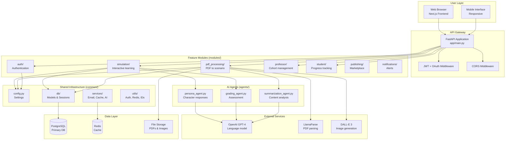
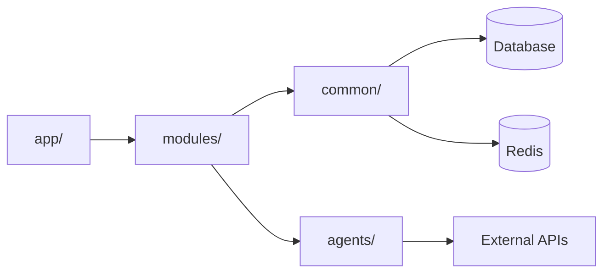
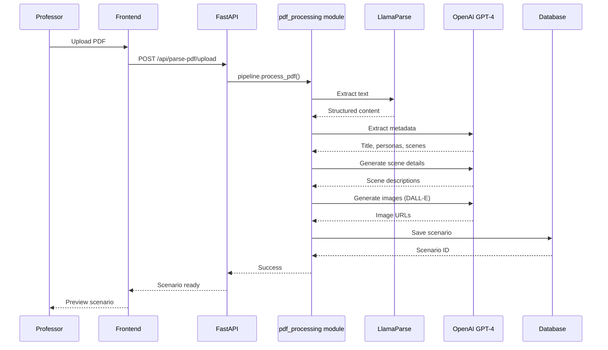
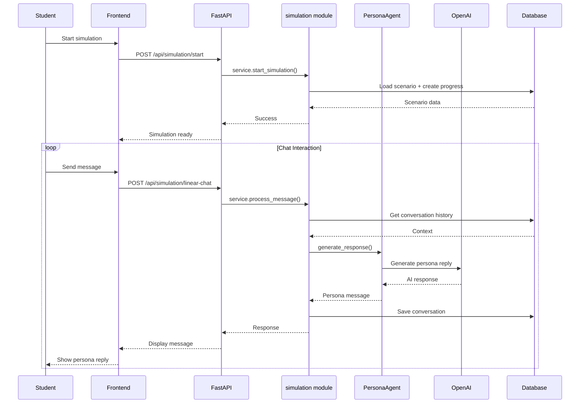
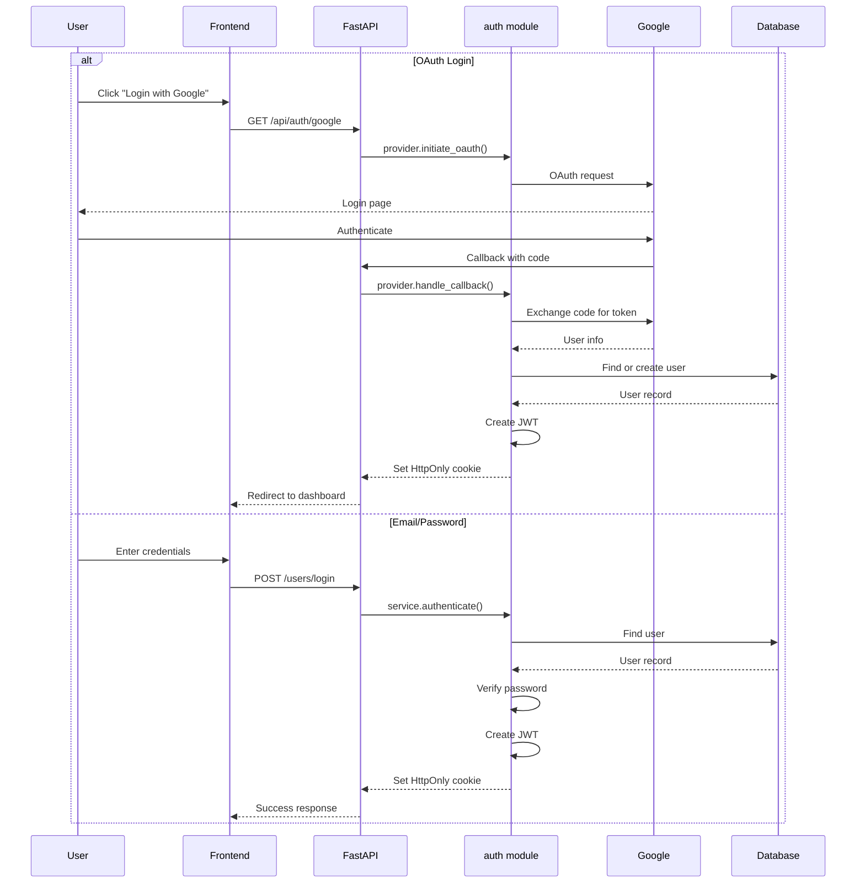
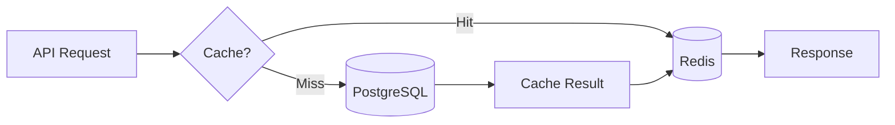

# System Architecture Overview

## Platform Vision

The **AI Agent Education Platform** is a comprehensive educational platform that transforms business case studies into immersive AI-powered simulations. The platform combines a **PDF-to-simulation pipeline** with a modular backend architecture, enabling educators and students to create and experience structured, multi-scene business simulations with dynamic AI persona interactions.

## Architecture Philosophy

The platform follows a **modular, feature-based architecture** that emphasizes:

1. **Pragmatic organization** - Code grouped by business capability, not technical layer
2. **Clear boundaries** - One-way dependencies prevent circular imports
3. **Minimal indirection** - Fewer layers for faster development
4. **Incremental growth** - Easy to add new features as modules
5. **Testability** - Repository pattern enables isolated unit testing

## High-Level Architecture



## Backend Structure

### Directory Organization

```
backend/
├── app/                          # FastAPI wiring layer
│   ├── main.py                   # Application entry point
│   ├── dependencies.py           # DI providers (get_db, get_current_user)
│   ├── middleware.py             # CORS, auth, error handling
│   ├── lifespan.py               # Startup/shutdown hooks
│   └── router/                   # Thin routing layer
│       ├── auth.py               # Auth endpoints wrapper
│       └── ...
│
├── common/                       # Shared infrastructure
│   ├── config.py                 # Pydantic settings (env vars)
│   ├── logging.py                # Structured logging
│   ├── exceptions.py             # Custom exception classes
│   ├── db/                       # Database layer
│   │   ├── base.py               # SQLAlchemy Base
│   │   ├── core.py               # Engine, sessions, get_db()
│   │   ├── mixins.py             # Reusable model columns
│   │   └── models/               # Shared ORM models
│   │       ├── user.py           # User model
│   │       ├── cache.py          # Cache model
│   │       └── notifications.py  # Notification model
│   ├── utils/                    # Helper utilities
│   │   ├── auth.py               # JWT, password hashing
│   │   ├── redis_manager.py     # Redis client wrapper
│   │   └── id_generator.py      # ID generation utilities
│   └── services/                 # Cross-cutting services (future)
│
├── modules/                      # Feature modules (business logic)
│   ├── simulation/               # Simulation execution
│   │   ├── router.py             # Simulation endpoints
│   │   ├── service.py            # Business logic
│   │   ├── repository.py         # Data access
│   │   └── schemas/              # Pydantic models
│   ├── pdf_processing/           # PDF to scenario pipeline
│   │   ├── router.py             # PDF upload endpoints
│   │   ├── pipeline.py           # Orchestration
│   │   ├── parser_service.py    # LlamaParse integration
│   │   ├── ai_extraction_service.py  # GPT-4 extraction
│   │   ├── progress_service.py  # WebSocket progress
│   │   └── repository.py         # Data persistence
│   ├── auth/                     # Authentication & authorization
│   │   ├── router.py             # Login, register, OAuth
│   │   ├── service.py            # Auth logic
│   │   ├── provider.py           # OAuth providers
│   │   └── schemas.py            # Auth models
│   ├── professor/                # Professor features
│   │   ├── router.py             # Main router
│   │   ├── routers/              # Sub-routers
│   │   │   ├── cohorts.py        # Cohort management
│   │   │   ├── grading.py        # Grading interface
│   │   │   ├── invitations.py   # Student invitations
│   │   │   └── messages.py       # Messaging
│   │   └── schemas/              # Professor models
│   ├── student/                  # Student features
│   │   ├── router.py             # Main router
│   │   ├── routers/              # Sub-routers
│   │   │   ├── simulation_instances.py  # Student simulations
│   │   │   ├── cohorts.py        # Cohort view
│   │   │   └── messages.py       # Messaging
│   │   └── schemas/              # Student models
│   ├── notifications/            # Notification system
│   │   ├── router.py             # Notification endpoints
│   │   └── schemas/              # Notification models
│   └── publishing/               # Marketplace features
│       ├── router.py             # Publishing endpoints
│       └── schemas/              # Publishing models
│
├── agents/                       # AI agent implementations
│   ├── persona_agent.py          # Persona AI interactions
│   ├── grading_agent.py          # Assessment AI
│   └── summarization_agent.py   # Content analysis AI
│
├── services/                     # Legacy services (being migrated)
│   ├── simulation_engine.py     # Simulation orchestration
│   ├── session_manager.py       # Session management
│   ├── vector_store.py          # Vector embeddings
│   └── ...
│
├── database/                     # Legacy database layer (being migrated)
│   ├── connection.py             # Old connection logic
│   ├── models.py                 # Monolithic models file
│   ├── schemas.py                # Shared schemas
│   └── migrations/               # Alembic migrations
│
└── tests/                        # Test suite
    ├── conftest.py               # Pytest configuration
    └── modules/                  # Feature-specific tests
```

### Dependency Flow



**Key Principle**: Dependencies flow in one direction:
- `app/` imports from `modules/`
- `modules/` imports from `common/` and `agents/`
- `common/` has no dependencies on `modules/` or `app/`
- No circular imports possible

## Module Pattern

Each feature module follows a consistent structure:

```
modules/<feature>/
├── router.py          # FastAPI endpoints (HTTP layer)
├── service.py         # Business logic (orchestration)
├── repository.py      # Data access (queries)
├── schemas/           # Pydantic models
│   ├── dto.py         # Data transfer objects
│   └── models.py      # Domain models (if not in common/db/models/)
├── tasks.py           # Background tasks (optional)
└── README.md          # Module documentation (optional)
```

### Responsibilities

1. **router.py** - Thin HTTP layer
   - Validates request/response with Pydantic schemas
   - Calls service methods
   - Returns appropriate HTTP status codes
   - Handles errors with HTTPException

2. **service.py** - Business logic
   - Orchestrates operations across repositories
   - Validates business rules
   - Coordinates with AI agents
   - Manages transactions

3. **repository.py** - Data access
   - Encapsulates database queries
   - Uses SQLAlchemy ORM
   - No business logic
   - Returns domain objects

4. **schemas/** - Data models
   - Request/response validation
   - Domain-specific DTOs
   - Type safety with Pydantic

## Core Workflows

### 1. PDF-to-Simulation Pipeline



### 2. Simulation Execution



### 3. Authentication Flow



## Data Model Overview

### Core Entities

1. **User** (`common/db/models/user.py`)
   - Authentication & profile
   - Role-based access (student/professor/admin)
   - OAuth integration (Google)

2. **Scenario** (database/models.py - to be migrated)
   - Business case content
   - Learning objectives
   - Metadata (industry, difficulty, duration)

3. **ScenarioPersona** (database/models.py)
   - AI character definitions
   - Personality traits (JSONB)
   - System prompts for AI

4. **ScenarioScene** (database/models.py)
   - Sequential learning stages
   - User goals per scene
   - Success criteria

5. **UserProgress** (database/models.py)
   - Simulation state tracking
   - Scene completion
   - Performance metrics

6. **ConversationLog** (database/models.py)
   - Chat history
   - AI context tracking
   - Performance monitoring

7. **Cohort** (database/models.py)
   - Professor-managed groups
   - Scenario assignments
   - Time-bound learning

8. **CohortInvitation** (database/models.py)
   - Student invitations
   - Token-based enrollment
   - Expiration management

9. **Notification** (`common/db/models/notifications.py`)
   - User alerts
   - Read/unread tracking
   - Type categorization

## Technology Stack

### Backend Core
- **FastAPI** - Modern, fast web framework with async support
- **Python 3.11+** - Type hints, async/await, modern features
- **SQLAlchemy 2.0** - Modern ORM with async support
- **Pydantic 2.0** - Data validation and settings management
- **Alembic** - Database migration management
- **uv** - Fast Python package installer

### AI/ML Stack
- **OpenAI GPT-4** - Primary language model
- **LlamaParse** - PDF parsing and extraction
- **DALL-E 3** - Image generation
- **LangChain** - AI agent framework (legacy, being phased out)

### Data Layer
- **PostgreSQL 14+** - Primary database
  - JSONB for flexible schema
  - pgvector for embeddings (optional)
  - Full-text search
- **Redis 6+** - Caching and sessions
  - Response caching
  - Session storage
  - Rate limiting

### Frontend
- **Next.js 15** - React framework
- **TypeScript** - Type safety
- **Tailwind CSS** - Utility-first styling
- **shadcn/ui** - Component library

### DevOps
- **Docker** - Local development
- **Railway** - Cloud deployment
- **GitHub Actions** - CI/CD
- **Pytest** - Testing framework

## Performance Strategy

### 1. Caching


- AI responses cached (1 hour TTL)
- Database queries cached (5 min TTL)
- Scenario data cached (15 min TTL)
- Session data cached (30 min TTL)

### 2. Database Optimization
- Connection pooling (70 connections, 80 max overflow)
- Indexed queries on foreign keys
- Eager loading for relationships
- Pagination for large result sets

### 3. Async Processing
- FastAPI async endpoints
- Background tasks for long operations
- WebSocket for real-time updates
- Non-blocking I/O operations

## Security Architecture

### Authentication
- JWT tokens (30-minute expiry)
- HttpOnly cookies (no JavaScript access)
- Google OAuth integration
- bcrypt password hashing

### Authorization
- Role-based access control (RBAC)
- Resource ownership checks
- Admin-only endpoints (`require_admin` dependency)

### Data Protection
- Pydantic input validation
- SQLAlchemy ORM (SQL injection prevention)
- Rate limiting on authentication endpoints
- CORS policy enforcement

### Production Security
- HTTPS only
- Secure cookies (SameSite=None, Secure)
- Environment-based configuration
- Secrets in environment variables

## Scalability Considerations

### Horizontal Scaling
- Stateless API design (JWT authentication)
- Load balancer ready
- Database connection pooling
- Redis for shared state

### Vertical Scaling
- Async processing reduces thread usage
- Connection pooling optimizes DB connections
- Caching reduces database load

### Module Independence
- Feature modules can scale independently
- Clear boundaries enable microservice migration
- Repository pattern enables database sharding

## Migration Status

The platform is currently migrating from a monolithic structure to the modular architecture:

### Completed
- ✅ `modules/pdf_processing` - PDF pipeline fully modular
- ✅ `modules/auth` - Authentication with OAuth
- ✅ `modules/professor` - Professor features with sub-routers
- ✅ `modules/student` - Student features with sub-routers
- ✅ `common/db/base.py` - SQLAlchemy Base
- ✅ `common/db/core.py` - Database engine and sessions
- ✅ `common/config.py` - Centralized settings
- ✅ `common/db/models/user.py` - User model extracted
- ✅ `common/db/models/notifications.py` - Notifications model

### In Progress
- 🔄 `modules/simulation` - Simulation execution (router exists, needs service/repository)
- 🔄 Database models migration to `common/db/models/` and module-specific models
- 🔄 Legacy `services/` to `common/services/`

### Pending
- ⏳ `modules/publishing` - Marketplace features
- ⏳ `modules/notifications` - Full notification system
- ⏳ Test suite expansion
- ⏳ API documentation updates

## Development Guidelines

### Adding a New Feature Module

1. Create module directory: `modules/<feature>/`
2. Implement router.py with FastAPI endpoints
3. Implement service.py with business logic
4. Implement repository.py for data access
5. Create schemas/ for Pydantic models
6. Add router to `app/main.py`
7. Write tests in `tests/modules/<feature>/`

### Code Organization Rules

1. **Routers are thin** - Validate requests, call services
2. **Services contain logic** - Orchestrate operations
3. **Repositories access data** - Abstract queries
4. **No circular dependencies** - Follow dependency flow
5. **Use type hints** - Enable static type checking

### Testing Strategy

1. **Unit tests** - Test services and repositories in isolation
2. **Integration tests** - Test router + service + repository
3. **API tests** - Test HTTP endpoints end-to-end
4. **Fixtures** - Shared test data in `tests/conftest.py`

## Future Enhancements

### Phase 1 (Q1 2025)
- Complete modular migration
- Comprehensive test coverage
- API versioning
- Improved error handling

### Phase 2 (Q2 2025)
- GraphQL API
- Real-time collaboration
- Advanced analytics
- Mobile app support

### Phase 3 (Q3 2025)
- Microservices architecture
- Multiple AI provider support
- Advanced caching strategies
- Kubernetes deployment

This architecture provides a solid foundation for scaling the platform while maintaining code quality and developer productivity.
