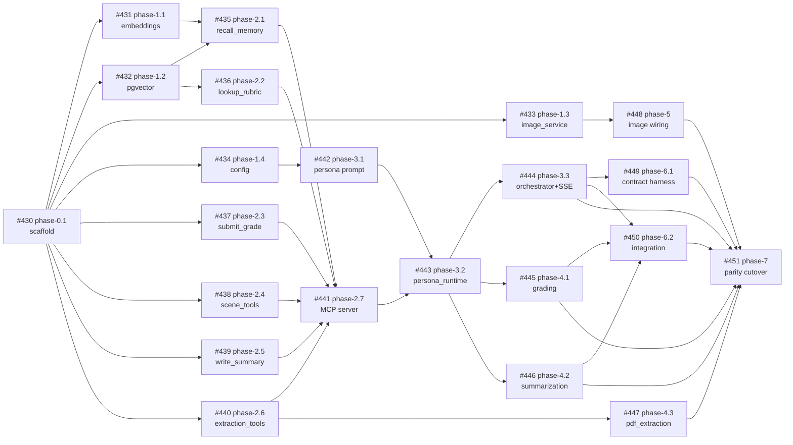

# Rewrite Breakdown — Ticketed Sub-Projects

This file is the **source of truth** for the Claude Agent SDK rewrite. It
breaks `plan/REWRITE_PLAN.md` into small, independently verifiable tickets.
Each ticket maps 1:1 to a GitHub issue labeled `rewrite-agent-sdk`.

> **2026-04-12 migration** — the track was retargeted from `rewrite/agent-sdk`
> onto `ralph-looped` so per-ticket PRs land incrementally on the active
> ralph-looped branch (preserving existing ralph-looped progress) instead of
> accumulating on an orphan branch for one big cutover. Issues #407–#428
> were closed (`state_reason=not_planned`); the 22 replacement issues
> (#430–#451) carry the same scope/files/tests/merge-gate but target
> `ralph-looped`, auto-trigger CodeRabbit plans, and auto-invoke a `@claude`
> implementation session on creation.

## Branch topology

```
ralph-looped  (integration trunk)
  │
  ├── ralph-looped-rewrite-agent-sdk  (anchor @ ralph-looped@d212165 + REWRITE_PLAN.md)
  │     │
  │     ├── ralph-looped-rewrite/phase-0.1-scaffold-backend-v2   ──┐
  │     ├── ralph-looped-rewrite/phase-1.1-…                     ──┤
  │     ├── …                                                      ├── PR → ralph-looped
  │     └── ralph-looped-rewrite/phase-7-parity-run-rename-…     ──┘        (squash merge
  │                                                                         per ticket)
  └── (ongoing ralph-looped work — untouched; rewrite lands on top)
```

- **Anchor**: `ralph-looped-rewrite-agent-sdk` — forked off `ralph-looped@d212165`, contains `plan/REWRITE_PLAN.md` verbatim from `rewrite/agent-sdk@bc366fa`. Every feature branch forks from this anchor's HEAD. When enough tickets have merged, fast-forward the anchor onto the latest `ralph-looped` so subsequent feature branches start from current state.
- **Per-ticket feature branch**: `ralph-looped-rewrite/phase-X.Y-<slug>` (exact slug in the mapping table below).
- **PR target**: `ralph-looped`. Body must contain `Fixes #<new_issue>` for auto-close on merge.

## How sessions are invoked

Every regenerated ticket body carries both triggers at the bottom:

```
@coderabbitai plan

@claude please start a session to implement this ticket. Fork
`ralph-looped-rewrite/phase-X.Y-<slug>` off `ralph-looped-rewrite-agent-sdk`
and open the PR against `ralph-looped`.
```

- CodeRabbit responds with a "Coding Plan" comment (typically within 5–20 min).
- `@claude` spins up a Claude session that creates the feature branch, implements the scope, runs the merge gate, and opens the PR.

## Old → new issue mapping

| Ticket    | Old (closed, `not_planned`) | New (open, targets `ralph-looped`) | Feature branch |
| --------- | --------------------------- | ---------------------------------- | -------------- |
| phase-0.1 | #407 | **#430** | `ralph-looped-rewrite/phase-0.1-scaffold-backend-v2` |
| phase-1.1 | #408 | **#431** | `ralph-looped-rewrite/phase-1.1-common-services-embeddings-service` |
| phase-1.2 | #409 | **#432** | `ralph-looped-rewrite/phase-1.2-common-services-pgvector-store` |
| phase-1.3 | #410 | **#433** | `ralph-looped-rewrite/phase-1.3-common-services-image-service` |
| phase-1.4 | #411 | **#434** | `ralph-looped-rewrite/phase-1.4-common-config-settings` |
| phase-2.1 | #412 | **#435** | `ralph-looped-rewrite/phase-2.1-mcp-tool-recall-memory` |
| phase-2.2 | #413 | **#436** | `ralph-looped-rewrite/phase-2.2-mcp-tool-lookup-rubric` |
| phase-2.3 | #414 | **#437** | `ralph-looped-rewrite/phase-2.3-mcp-tool-submit-grade` |
| phase-2.4 | #415 | **#438** | `ralph-looped-rewrite/phase-2.4-mcp-tools-advance-scene-complete-scene` |
| phase-2.5 | #416 | **#439** | `ralph-looped-rewrite/phase-2.5-mcp-tool-write-summary` |
| phase-2.6 | #417 | **#440** | `ralph-looped-rewrite/phase-2.6-mcp-tools-extract-personas-scenes-object` |
| phase-2.7 | #418 | **#441** | `ralph-looped-rewrite/phase-2.7-assemble-sim-mcp-server` |
| phase-3.1 | #419 | **#442** | `ralph-looped-rewrite/phase-3.1-prompts-persona-system` |
| phase-3.2 | #420 | **#443** | `ralph-looped-rewrite/phase-3.2-persona-runtime-run-persona-turn` |
| phase-3.3 | #421 | **#444** | `ralph-looped-rewrite/phase-3.3-orchestrator-chat-handler-sse` |
| phase-4.1 | #422 | **#445** | `ralph-looped-rewrite/phase-4.1-grading-agent-one-shot-query` |
| phase-4.2 | #423 | **#446** | `ralph-looped-rewrite/phase-4.2-summarization-agent-one-shot-query` |
| phase-4.3 | #424 | **#447** | `ralph-looped-rewrite/phase-4.3-pdf-processing-agent-extraction` |
| phase-5   | #425 | **#448** | `ralph-looped-rewrite/phase-5-wire-image-service-avatars-scene-imagery` |
| phase-6.1 | #426 | **#449** | `ralph-looped-rewrite/phase-6.1-contract-test-harness-dual-target-fixtur` |
| phase-6.2 | #427 | **#450** | `ralph-looped-rewrite/phase-6.2-integration-one-scene-happy-path-w-fakec` |
| phase-7   | #428 | **#451** | `ralph-looped-rewrite/phase-7-parity-run-rename-cutover` |

## Dependency DAG (with new issue numbers)



A ticket becomes **ready** iff every upstream issue in the DAG is closed AND its PR merged into `ralph-looped`. The Ralph loop picks the earliest ready ticket by phase/number.

---

## How to read this file

Every ticket is a `### phase-X.Y: <title>` section followed by `- **key**:
value` lines. The keys below are **required** and parsed verbatim by
`scripts/rewrite/create-issues.py` and `scripts/rewrite/verify-ticket.sh`:

| Key | Meaning |
| --- | --- |
| `depends_on` | List of upstream `phase-X.Y` ids — ticket is not "ready" until every upstream PR is merged into `ralph-looped`. |
| `branch_prefix` | Feature branch name prefix the loop creates. |
| `files` | Comma-separated glob list of files this ticket may create or modify. The verifier rejects diffs outside this list. |
| `scope` | Exactly what to build. Grounded prose — this is what CodeRabbit sees when it plans. |
| `unit_tests_required` | Semicolon-separated test case names. The verifier greps the matching test file for each name. `none` is allowed for pure scaffold tickets. |
| `contract_tests_required` | Same format. `none` unless the ticket touches an endpoint. |
| `verification` | The exact command(s) that must exit 0 before merge. |
| `non_goals` | Out-of-scope items — the verifier does not enforce these but CodeRabbit and Claude should read them. |

Target branch for every PR in this track: **`ralph-looped`**. Feature branches
fork off the anchor `ralph-looped-rewrite-agent-sdk` (see *Branch topology*
above).

Base directory for all new code: **`backend_v2/`**.

---

## Tickets

### phase-0.1: Scaffold backend_v2/
- **depends_on**: []
- **branch_prefix**: rewrite/phase-0-scaffold
- **files**: backend_v2/**, pyproject.toml
- **scope**: `cp -r backend backend_v2` then strip every LangChain
  import. Delete `backend_v2/modules/simulation/` entirely,
  `backend_v2/modules/pdf_processing/ai_extraction_service.py`,
  `backend_v2/modules/pdf_processing/image_generation_service.py`, and
  `backend_v2/common/services/simulation_helper/`. Update
  `pyproject.toml` to drop `langchain*`, `langchain-postgres`, and
  `langchain-experimental`; add `claude-agent-sdk`, `anthropic`,
  `google-genai`, `pgvector`, `mcp`. Keep `alembic`, `sqlalchemy`,
  `fastapi`, `openai`. Do not add any business logic — this ticket
  only produces an empty shell where later tickets slot in.
- **unit_tests_required**: none
- **contract_tests_required**: none
- **verification**: `cd backend_v2 && uv sync` exits 0; `cd backend_v2
  && uv run alembic upgrade heads` exits 0 against the shared dev DB;
  `cd backend_v2 && uv run python -c "import app.main"` exits 0.
- **non_goals**: no new modules, no new MCP code, no prompt files. Do
  not touch `backend/` (legacy tree stays live).

### phase-1.1: common/services/embeddings_service.py
- **depends_on**: [phase-0.1]
- **branch_prefix**: rewrite/phase-1-embeddings
- **files**: backend_v2/common/services/embeddings_service.py, backend_v2/tests/common/services/test_embeddings_service.py
- **scope**: Thin async wrapper around `openai.AsyncOpenAI`. Public
  surface: `async def embed(texts: list[str]) -> list[list[float]]`.
  Uses the model name from `common/config.py`
  (`EMBEDDING_MODEL`, default `text-embedding-3-small`). Retries on
  `openai.RateLimitError` with exponential backoff (up to 3 attempts,
  base 1s). Empty input returns `[]` without hitting the API. No
  LangChain imports. No global client — take the client via
  constructor injection so tests can substitute a mock.
- **unit_tests_required**: test_embed_happy_path; test_embed_empty_input_short_circuits; test_embed_retries_on_rate_limit; test_embed_raises_on_malformed_response
- **contract_tests_required**: none
- **verification**: `cd backend_v2 && uv run pytest tests/common/services/test_embeddings_service.py -q --cov=common/services/embeddings_service --cov-fail-under=90` passes.
- **non_goals**: no caching layer (that belongs in a later ticket), no batching helper, no logging configuration changes.

### phase-1.2: common/services/pgvector_store.py
- **depends_on**: [phase-0.1]
- **branch_prefix**: rewrite/phase-1-pgvector
- **files**: backend_v2/common/services/pgvector_store.py, backend_v2/tests/common/services/test_pgvector_store.py
- **scope**: Direct SQL access against the existing
  `vector_embeddings` and `grading_material_chunks` tables via
  `psycopg` + `pgvector`. Functions:
  `async def similarity_search(query_embedding: list[float],
  namespace: str, k: int = 5) -> list[dict]` and
  `async def upsert(embedding: list[float], metadata: dict,
  namespace: str) -> str`. Use the `SimulationDatabase` session
  factory already used elsewhere — do not open raw connections.
  Replaces the LangChain `PGVector` wrapper; the table schema is
  unchanged so no Alembic migration.
- **unit_tests_required**: test_similarity_search_returns_topk_ordered; test_similarity_search_filters_by_namespace; test_upsert_inserts_row_with_metadata; test_upsert_is_idempotent_on_same_key
- **contract_tests_required**: none
- **verification**: `cd backend_v2 && uv run pytest tests/common/services/test_pgvector_store.py -q --cov=common/services/pgvector_store --cov-fail-under=85` passes against a disposable Postgres fixture (see `backend_v2/tests/conftest.py` pgvector fixture).
- **non_goals**: no query-result caching, no automatic re-embedding, no schema changes.

### phase-1.3: common/services/image_service.py
- **depends_on**: [phase-0.1]
- **branch_prefix**: rewrite/phase-1-image-service
- **files**: backend_v2/common/services/image_service.py, backend_v2/tests/common/services/test_image_service.py
- **scope**: Strategy-pattern image generator with two backends:
  Gemini 2.5 Flash Image (default, via `google-genai`) and OpenAI
  DALL·E (fallback, behind `IMAGE_PROVIDER=openai`). Public API:
  `async def generate_image(prompt: str, size: str = "1024x1024")
  -> bytes`. Reads `IMAGE_PROVIDER`, `GOOGLE_GENAI_API_KEY`,
  `OPENAI_API_KEY` from `common/config.py`. Both backends return raw
  bytes; callers handle storage.
- **unit_tests_required**: test_generate_image_uses_gemini_by_default; test_generate_image_falls_back_to_openai_when_configured; test_generate_image_raises_on_provider_misconfiguration; test_generate_image_passes_size_to_provider
- **contract_tests_required**: none
- **verification**: `cd backend_v2 && uv run pytest tests/common/services/test_image_service.py -q --cov=common/services/image_service --cov-fail-under=85` passes. Both provider paths mocked — no live API calls.
- **non_goals**: no S3 upload (caller's job), no prompt-safety filter, no thumbnailing.

### phase-1.4: common/config.py settings
- **depends_on**: [phase-0.1]
- **branch_prefix**: rewrite/phase-1-config
- **files**: backend_v2/common/config.py, backend_v2/tests/common/test_config.py
- **scope**: Add Pydantic settings fields:
  `ANTHROPIC_API_KEY: str`,
  `GOOGLE_GENAI_API_KEY: str | None = None`,
  `PERSONA_MODEL: str = "claude-sonnet-4-6"`,
  `GRADING_MODEL: str = "claude-haiku-4-5-20251001"`,
  `SUMMARIZATION_MODEL: str = "claude-haiku-4-5-20251001"`,
  `IMAGE_PROVIDER: Literal["gemini","openai"] = "gemini"`,
  `EMBEDDING_MODEL: str = "text-embedding-3-small"`. Every field is
  env-overridable. Existing settings keep their current defaults.
- **unit_tests_required**: test_settings_reads_anthropic_api_key_from_env; test_settings_default_persona_model_is_sonnet_4_6; test_settings_rejects_invalid_image_provider; test_settings_env_override_wins_over_default
- **contract_tests_required**: none
- **verification**: `cd backend_v2 && uv run pytest tests/common/test_config.py -q` passes.
- **non_goals**: no `.env` file changes, no documentation updates, no deployment config.

### phase-2.1: MCP tool — recall_memory
- **depends_on**: [phase-1.1, phase-1.2]
- **branch_prefix**: rewrite/phase-2-recall-memory
- **files**: backend_v2/modules/simulation/mcp/memory_tools.py, backend_v2/tests/modules/simulation/mcp/test_memory_tools.py
- **scope**: Port `backend/common/services/simulation_helper/scene_memory_service.py` hybrid retrieval behind an `@tool`-decorated async function `recall_memory(persona_id: int, scene_id: int, query: str, k: int = 5)`. Embeds `query` via `embeddings_service`, runs `pgvector_store.similarity_search` scoped to the persona+scene namespace, returns top-k chunks as `{"content": [{"type": "text", "text": ...}], "is_error": False}`. Missing persona → `{"is_error": True, ...}` (never raises). No direct DB access — go through `modules/simulation/repository.py` (new file, may be created in this ticket for memory-related queries only).
- **unit_tests_required**: test_recall_memory_returns_topk_chunks; test_recall_memory_empty_query_returns_empty; test_recall_memory_missing_persona_returns_error_envelope; test_recall_memory_respects_k_param
- **contract_tests_required**: none
- **verification**: `cd backend_v2 && uv run pytest tests/modules/simulation/mcp/test_memory_tools.py -q --cov=modules/simulation/mcp/memory_tools --cov-fail-under=85` passes.
- **non_goals**: no server assembly (that's phase-2.7), no rubric lookup, no write path.

### phase-2.2: MCP tool — lookup_rubric
- **depends_on**: [phase-1.2]
- **branch_prefix**: rewrite/phase-2-lookup-rubric
- **files**: backend_v2/modules/simulation/mcp/grading_tools.py, backend_v2/tests/modules/simulation/mcp/test_grading_tools_lookup.py
- **scope**: Port `backend/common/services/simulation_helper/grading_vector_store.py` behind `lookup_rubric(scenario_id: int, query: str, k: int = 3)`. Same MCP envelope as phase-2.1. Shares the `grading_tools.py` file with phase-2.3 — this ticket defines the file and adds only `lookup_rubric`. phase-2.3 will append `submit_grade` to the same file.
- **unit_tests_required**: test_lookup_rubric_returns_topk; test_lookup_rubric_scoped_to_scenario; test_lookup_rubric_unknown_scenario_returns_error_envelope
- **contract_tests_required**: none
- **verification**: `cd backend_v2 && uv run pytest tests/modules/simulation/mcp/test_grading_tools_lookup.py -q --cov=modules/simulation/mcp/grading_tools --cov-fail-under=80` passes.
- **non_goals**: do not implement `submit_grade` here (phase-2.3).

### phase-2.3: MCP tool — submit_grade
- **depends_on**: [phase-0.1]
- **branch_prefix**: rewrite/phase-2-submit-grade
- **files**: backend_v2/modules/simulation/mcp/grading_tools.py, backend_v2/tests/modules/simulation/mcp/test_grading_tools_submit.py
- **scope**: Append `submit_grade(user_progress_id: int, scene_id: int, rubric_scores: dict, strictness: str)` to `grading_tools.py`. Writes to `scene_progress.grading_result` and inserts one `grading_materials` row. Validates that `rubric_scores` keys match the scenario's rubric; mismatched keys → `is_error=True`. Uses an existing SQLAlchemy session factory.
- **unit_tests_required**: test_submit_grade_writes_scene_progress_row; test_submit_grade_inserts_grading_materials_row; test_submit_grade_rejects_unknown_rubric_keys; test_submit_grade_idempotent_on_same_user_progress
- **contract_tests_required**: none
- **verification**: `cd backend_v2 && uv run pytest tests/modules/simulation/mcp/test_grading_tools_submit.py -q --cov=modules/simulation/mcp/grading_tools --cov-fail-under=85` passes.
- **non_goals**: no grading prompt (phase-4.1), no notification dispatch.

### phase-2.4: MCP tools — advance_scene + complete_scene
- **depends_on**: [phase-0.1]
- **branch_prefix**: rewrite/phase-2-scene-tools
- **files**: backend_v2/modules/simulation/mcp/scene_tools.py, backend_v2/tests/modules/simulation/mcp/test_scene_tools.py
- **scope**: Port `backend/modules/simulation/core/scene_progression.py` state-machine transitions into two MCP tools: `advance_scene(user_progress_id: int)` moves the learner to the next scene in order; `complete_scene(user_progress_id: int, scene_id: int, summary: str)` closes the current scene. Both validate preconditions (correct current scene, not already completed) and return `is_error=True` with a descriptive message on violation.
- **unit_tests_required**: test_advance_scene_moves_to_next_in_order; test_advance_scene_noop_on_final_scene; test_complete_scene_marks_completed; test_complete_scene_rejects_wrong_current_scene
- **contract_tests_required**: none
- **verification**: `cd backend_v2 && uv run pytest tests/modules/simulation/mcp/test_scene_tools.py -q --cov=modules/simulation/mcp/scene_tools --cov-fail-under=85` passes.
- **non_goals**: no grading trigger (orchestrator's job), no summary generation (phase-2.5 + 4.2).

### phase-2.5: MCP tool — write_summary
- **depends_on**: [phase-0.1]
- **branch_prefix**: rewrite/phase-2-write-summary
- **files**: backend_v2/modules/simulation/mcp/memory_tools.py, backend_v2/tests/modules/simulation/mcp/test_memory_tools_summary.py
- **scope**: Append `write_summary(user_progress_id: int, scene_id: int, summary_text: str)` to `memory_tools.py` (same file as phase-2.1). Inserts a `conversation_summaries` row; enforces one summary per (user_progress, scene) — second call updates the existing row.
- **unit_tests_required**: test_write_summary_inserts_new_row; test_write_summary_updates_existing_row; test_write_summary_rejects_empty_text
- **contract_tests_required**: none
- **verification**: `cd backend_v2 && uv run pytest tests/modules/simulation/mcp/test_memory_tools_summary.py -q --cov=modules/simulation/mcp/memory_tools --cov-fail-under=85` passes.
- **non_goals**: do not generate the summary text (that's phase-4.2).

### phase-2.6: MCP tools — extract_personas/scenes/objectives
- **depends_on**: [phase-0.1]
- **branch_prefix**: rewrite/phase-2-extraction-tools
- **files**: backend_v2/modules/simulation/mcp/extraction_tools.py, backend_v2/tests/modules/simulation/mcp/test_extraction_tools.py
- **scope**: Three `@tool` functions: `extract_personas(pdf_text: str)`, `extract_scenes(pdf_text: str)`, `extract_objectives(pdf_text: str)`. Each parses a structured JSON blob from a Claude response passed as input, validates against a Pydantic schema, and returns the parsed list in an MCP envelope. Invalid JSON → `is_error=True`. The tools themselves do not call Claude — they're pure parsers/validators invoked by the extraction orchestrator in phase-4.3.
- **unit_tests_required**: test_extract_personas_parses_valid_json; test_extract_personas_returns_error_on_malformed_json; test_extract_scenes_returns_ordered_list; test_extract_objectives_validates_schema
- **contract_tests_required**: none
- **verification**: `cd backend_v2 && uv run pytest tests/modules/simulation/mcp/test_extraction_tools.py -q --cov=modules/simulation/mcp/extraction_tools --cov-fail-under=85` passes.
- **non_goals**: no LLM calls, no PDF parsing (LlamaParse stays upstream).

### phase-2.7: Assemble `sim` MCP server
- **depends_on**: [phase-2.1, phase-2.2, phase-2.3, phase-2.4, phase-2.5, phase-2.6]
- **branch_prefix**: rewrite/phase-2-mcp-server
- **files**: backend_v2/modules/simulation/mcp/server.py, backend_v2/tests/modules/simulation/mcp/test_server.py
- **scope**: Call `create_sdk_mcp_server(name="sim", version="1.0.0", tools=[recall_memory, lookup_rubric, submit_grade, advance_scene, complete_scene, write_summary, extract_personas, extract_scenes, extract_objectives])` and expose the resulting `sim_server` as a module-level singleton. The test confirms the server advertises exactly the expected tool names.
- **unit_tests_required**: test_server_registers_all_nine_tools; test_server_tool_names_follow_mcp_sim_prefix
- **contract_tests_required**: none
- **verification**: `cd backend_v2 && uv run pytest tests/modules/simulation/mcp/test_server.py -q` passes.
- **non_goals**: no new tools, no server-wide middleware.

### phase-3.1: prompts/persona_system.py
- **depends_on**: [phase-1.4]
- **branch_prefix**: rewrite/phase-3-persona-prompt
- **files**: backend_v2/modules/simulation/prompts/persona_system.py, backend_v2/modules/simulation/prompts/__init__.py, backend_v2/tests/modules/simulation/prompts/test_persona_system.py
- **scope**: Port `_BIG_FIVE_DESCRIPTORS` dict and system-prompt
  template from `backend/modules/simulation/agents/persona_agent.py`
  (lines 40–80 of the original). Public API:
  `def build_persona_system_prompt(persona: SimulationPersona,
  scene_context: dict) -> str`. No LangChain imports — plain string
  formatting. Output must be byte-stable for a given input (covered
  by the snapshot test).
- **unit_tests_required**: test_big_five_high_openness_rendered; test_big_five_low_openness_rendered; test_snapshot_eight_trait_permutations; test_scene_context_appears_in_output
- **contract_tests_required**: none
- **verification**: `cd backend_v2 && uv run pytest tests/modules/simulation/prompts/test_persona_system.py -q --cov=modules/simulation/prompts/persona_system --cov-fail-under=90` passes.
- **non_goals**: no grading prompt, no summarization prompt, no runtime integration.

### phase-3.2: persona_runtime.run_persona_turn
- **depends_on**: [phase-3.1, phase-2.7]
- **branch_prefix**: rewrite/phase-3-persona-runtime
- **files**: backend_v2/modules/simulation/persona_runtime.py, backend_v2/tests/modules/simulation/test_persona_runtime.py, backend_v2/tests/fake_claude.py
- **scope**: Implement the runtime sketched in the plan's Phase 3 block. Signature: `async def run_persona_turn(persona, user_progress, user_message, session_id) -> AsyncIterator[str]`. Builds `ClaudeAgentOptions(model=settings.persona_model, system_prompt=build_persona_system_prompt(...), mcp_servers={"sim": sim_server}, allowed_tools=["mcp__sim__recall_memory", "mcp__sim__lookup_rubric"], tools=[], resume=session_id)`, calls `claude_agent_sdk.query`, streams `TextBlock` content, and persists the session id via the existing `agent_sessions` repository when `ResultMessage` arrives. Also ships a reusable `FakeClaudeClient` in `tests/fake_claude.py` for downstream tickets.
- **unit_tests_required**: test_run_persona_turn_streams_text_blocks_in_order; test_run_persona_turn_persists_session_id_on_result; test_run_persona_turn_resumes_with_existing_session_id; test_run_persona_turn_passes_allowed_tools
- **contract_tests_required**: none
- **verification**: `cd backend_v2 && uv run pytest tests/modules/simulation/test_persona_runtime.py -q --cov=modules/simulation/persona_runtime --cov-fail-under=85` passes.
- **non_goals**: no orchestrator (phase-3.3), no grading, no SSE wire format.

### phase-3.3: orchestrator + chat_handler SSE
- **depends_on**: [phase-3.2]
- **branch_prefix**: rewrite/phase-3-orchestrator-chat
- **files**: backend_v2/modules/simulation/orchestrator.py, backend_v2/modules/simulation/handlers/chat_handler.py, backend_v2/modules/simulation/router.py, backend_v2/tests/modules/simulation/test_orchestrator.py, backend_v2/tests/contract/simulation/test_chat_stream.py
- **scope**: Thin `ChatOrchestrator` — loads `user_progress`, selects target persona, enforces scene preconditions, delegates to `persona_runtime.run_persona_turn`. No LLM calls live in the orchestrator. Chat handler is a FastAPI route that translates the yielded text stream into the **existing** SSE wire format `{type, content, persona_id?, scene_id?, ...}` (see `plan/REWRITE_PLAN.md` "Preserved API contract" section). Register the router so `POST /api/simulation/linear-chat-stream` and its alias `POST /api/stream-chat` work.
- **unit_tests_required**: test_orchestrator_selects_current_scene_persona; test_orchestrator_rejects_out_of_order_scene; test_chat_handler_emits_sse_chunks_in_expected_envelope; test_chat_handler_sets_content_type_text_event_stream
- **contract_tests_required**: test_linear_chat_stream_contract; test_stream_chat_alias_contract; test_linear_chat_stream_rejects_unauthenticated
- **verification**: `cd backend_v2 && uv run pytest tests/modules/simulation/test_orchestrator.py tests/contract/simulation/test_chat_stream.py -q --cov=modules/simulation/orchestrator --cov=modules/simulation/handlers/chat_handler --cov-fail-under=80` passes.
- **non_goals**: no grading endpoint, no summarization, no WebSocket support (SSE only).

### phase-4.1: grading_agent one-shot query
- **depends_on**: [phase-3.2]
- **branch_prefix**: rewrite/phase-4-grading
- **files**: backend_v2/modules/simulation/grading_agent.py, backend_v2/modules/simulation/prompts/grading_system.py, backend_v2/tests/modules/simulation/test_grading_agent.py, backend_v2/tests/contract/simulation/test_grade_endpoint.py
- **scope**: One-shot `claude_agent_sdk.query` with `settings.grading_model` (Haiku 4.5), `grading_system.py` prompt, and `allowed_tools=["mcp__sim__lookup_rubric", "mcp__sim__submit_grade"]`. The agent loop terminates after `submit_grade` fires. Exposed as `async def grade_scene(user_progress_id, scene_id) -> GradingResult`. Wires into the existing `GET /api/simulation/grade` endpoint.
- **unit_tests_required**: test_grade_scene_uses_grading_model; test_grade_scene_allows_only_grading_tools; test_grade_scene_returns_result_from_submit_grade_tool; test_grade_scene_handles_tool_error_envelope
- **contract_tests_required**: test_grade_endpoint_returns_200_with_result; test_grade_endpoint_returns_202_when_queued
- **verification**: `cd backend_v2 && uv run pytest tests/modules/simulation/test_grading_agent.py tests/contract/simulation/test_grade_endpoint.py -q --cov=modules/simulation/grading_agent --cov-fail-under=85` passes.
- **non_goals**: no rubric authoring UI, no regrade endpoint changes.

### phase-4.2: summarization_agent one-shot query
- **depends_on**: [phase-3.2]
- **branch_prefix**: rewrite/phase-4-summarization
- **files**: backend_v2/modules/simulation/summarization_agent.py, backend_v2/modules/simulation/prompts/summarization_system.py, backend_v2/tests/modules/simulation/test_summarization_agent.py
- **scope**: One-shot `query` with `settings.summarization_model`, scene-transcript-in-prompt, and `allowed_tools=["mcp__sim__write_summary"]`. Writes `conversation_summaries` via the tool. Invoked at scene completion from the orchestrator.
- **unit_tests_required**: test_summarize_scene_uses_summarization_model; test_summarize_scene_writes_via_mcp_tool; test_summarize_scene_passes_transcript_in_prompt; test_summarize_scene_handles_empty_transcript
- **contract_tests_required**: none
- **verification**: `cd backend_v2 && uv run pytest tests/modules/simulation/test_summarization_agent.py -q --cov=modules/simulation/summarization_agent --cov-fail-under=85` passes.
- **non_goals**: no user-visible endpoint (summaries are internal).

### phase-4.3: pdf_processing/agent_extraction.py
- **depends_on**: [phase-2.6]
- **branch_prefix**: rewrite/phase-4-pdf-extraction
- **files**: backend_v2/modules/pdf_processing/agent_extraction.py, backend_v2/modules/pdf_processing/router.py, backend_v2/tests/modules/pdf_processing/test_agent_extraction.py, backend_v2/tests/contract/pdf_processing/test_parse_pdf_contract.py
- **scope**: Orchestrator-style `query` driven by the three `extract_*` tools from phase-2.6. Parses a LlamaParse-produced `pdf_text` into structured `SimulationPersona`/`SimulationScene`/objectives rows. Exposed through the existing `POST /api/pdf-processing/parse-pdf` endpoints — the wire contract must match `plan/REWRITE_PLAN.md`.
- **unit_tests_required**: test_agent_extraction_runs_all_three_tools; test_agent_extraction_persists_personas; test_agent_extraction_persists_scenes_in_order; test_agent_extraction_skips_empty_pdf
- **contract_tests_required**: test_parse_pdf_returns_expected_shape; test_parse_pdf_fast_autofill_contract
- **verification**: `cd backend_v2 && uv run pytest tests/modules/pdf_processing/test_agent_extraction.py tests/contract/pdf_processing/test_parse_pdf_contract.py -q --cov=modules/pdf_processing/agent_extraction --cov-fail-under=80` passes.
- **non_goals**: no LlamaParse replacement, no new progress-reporting transport, no image generation.

### phase-5: Wire image_service into avatars + scene imagery
- **depends_on**: [phase-1.3]
- **branch_prefix**: rewrite/phase-5-image-wiring
- **files**: backend_v2/modules/publishing/image_generation.py, backend_v2/modules/simulation/avatars.py, backend_v2/tests/modules/publishing/test_image_generation.py
- **scope**: Replace every callsite of the removed `image_generation_service` with the new `common/services/image_service.generate_image`. Persona avatars and scene imagery use the same strategy (Gemini default, OpenAI fallback). Storage path / S3 upload logic is preserved verbatim — only the generator call swaps.
- **unit_tests_required**: test_persona_avatar_calls_image_service; test_scene_image_calls_image_service; test_image_provider_env_flag_respected
- **contract_tests_required**: none
- **verification**: `cd backend_v2 && uv run pytest tests/modules/publishing/test_image_generation.py -q --cov=modules/publishing/image_generation --cov-fail-under=80` passes.
- **non_goals**: no prompt-engineering changes, no S3 schema changes.

### phase-6.1: Contract test harness (dual-target fixture)
- **depends_on**: [phase-3.3]
- **branch_prefix**: rewrite/phase-6-contract-harness
- **files**: backend_v2/tests/contract/conftest.py, backend_v2/tests/contract/README.md
- **scope**: Pytest fixtures `client_legacy` and `client_v2` that spin up both `backend/` and `backend_v2/` FastAPI apps against the same Postgres. A parametrized `client` fixture runs every contract test against both targets; identical assertions must pass. This harness is the ground truth for parity — every endpoint in the "Preserved API contract" section of `REWRITE_PLAN.md` eventually gets a contract test that runs through it.
- **unit_tests_required**: test_contract_harness_starts_both_targets; test_contract_harness_shares_database; test_contract_harness_cleans_up_between_tests
- **contract_tests_required**: none
- **verification**: `cd backend_v2 && uv run pytest tests/contract/ -q -k harness` passes; the fixture is importable from any `tests/contract/**/test_*.py` module.
- **non_goals**: no new endpoint tests (those land per-phase), no Playwright integration.

### phase-6.2: Integration — one-scene happy path w/ FakeClaudeClient
- **depends_on**: [phase-3.3, phase-4.1, phase-4.2]
- **branch_prefix**: rewrite/phase-6-integration-happy-path
- **files**: backend_v2/tests/integration/test_one_scene_happy_path.py, backend_v2/tests/fixtures/scenarios/one_scene.json
- **scope**: End-to-end test using `FakeClaudeClient` from phase-3.2. Flow: register → login → start simulation → 3 chat turns → advance scene → grade → assert `conversation_logs` has 6 rows, `agent_sessions.session_id` is stable across turns, `scene_progress.grading_result` is populated, `conversation_summaries` has one row. No live Anthropic calls.
- **unit_tests_required**: none
- **contract_tests_required**: none
- **verification**: `cd backend_v2 && uv run pytest tests/integration/test_one_scene_happy_path.py -q` passes end-to-end.
- **non_goals**: no multi-scene flow, no error-path exhaustiveness (those are follow-ups).

### phase-7: Parity run + rename cutover
- **depends_on**: [phase-3.3, phase-4.1, phase-4.2, phase-4.3, phase-5, phase-6.1, phase-6.2]
- **branch_prefix**: rewrite/phase-7-cutover
- **files**: backend/**, backend_v2/**, docker-compose.yml, .github/workflows/**, plan/REWRITE_PLAN.md
- **scope**: Run both backends against the same DB (`:8000` legacy, `:8001` v2). Execute the full contract-test suite against both via the phase-6.1 harness and confirm zero diffs. Pick one fixture scenario, run end-to-end on both, diff grading scores and transcripts. When green: rename `backend_v2 → backend` and archive the old tree on `legacy-backend-archive` branch. Update `docker-compose.yml`, CI workflows, and `CLAUDE.md` file paths.
- **unit_tests_required**: none
- **contract_tests_required**: test_parity_all_endpoints_match
- **verification**: `cd backend_v2 && uv run pytest tests/contract/ -q` passes identically against both targets; manual parity scenario produces a diff of zero on grading scores.
- **non_goals**: no new features, no performance tuning, no infrastructure changes beyond file paths.
